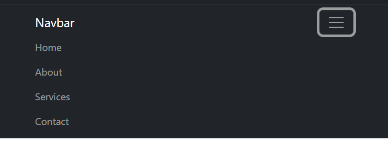

The only way I have designed websites in the past has been with Wix (which trust me, is not that difficult. I only have had a little previous experience with HTML and CSS, so this has all been a new experience for me. Yes, I prefer Wix just because it is so much easier, however, the opportunities with HTML and CSS are endless. SO endless that it can be very time-consuming and confusing to get exactly what you want by just using raw HTML and CSS. The solution? Using UI Frameworks.

## What is a UI framework? And what are the benefits?

A UI framework is like a library with tools to easily implement common parts UI design! For example, many websites use a navigation bar to get to different pages on the site. Here are two different examples of the navigation bar. One using HTML and the other using Bootstrap (a UI framework). Here is what the code looks like!
 
Plain HTML/CSS:

```html
<!DOCTYPE html>
<html lang="en">
<head>
  <meta charset="UTF-8">
  <meta name="viewport" content="width=device-width, initial-scale=1.0">
  <title>Responsive Navigation Bar</title>
  <style>
    /* Basic styles for navigation */
    nav {
      background-color: #333;
      color: #fff;
      padding: 10px;
    }

    nav ul {
      list-style-type: none;
      margin: 0;
      padding: 0;
      display: flex;
      justify-content: center;
    }

    nav ul li {
      margin: 0 10px;
    }

    nav ul li a {
      color: #fff;
      text-decoration: none;
    }

    @media (max-width: 768px) {
      /* Styles for smaller screens */
      nav ul {
        flex-direction: column;
        text-align: center;
      }

      nav ul li {
        margin: 5px 0;
      }
    }
  </style>
</head>
<body>
  <nav>
    <ul>
      <li><a href="#">Home</a></li>
      <li><a href="#">About</a></li>
      <li><a href="#">Services</a></li>
      <li><a href="#">Contact</a></li>
    </ul>
  </nav>
</body>
</html>

```


With Bootstrap:
```html
<!DOCTYPE html>
<html lang="en">
<head>
  <meta charset="UTF-8">
  <meta name="viewport" content="width=device-width, initial-scale=1.0">
  <title>Responsive Navigation Bar with Bootstrap</title>
  <!-- Bootstrap CSS -->
  <link href="https://cdn.jsdelivr.net/npm/bootstrap@5.3.0-alpha1/dist/css/bootstrap.min.css" rel="stylesheet">
</head>
<body>
  <nav class="navbar navbar-expand-lg navbar-dark bg-dark">
    <div class="container">
      <a class="navbar-brand" href="#">Navbar</a>
      <button class="navbar-toggler" type="button" data-bs-toggle="collapse" data-bs-target="#navbarNav" aria-controls="navbarNav" aria-expanded="false" aria-label="Toggle navigation">
        <span class="navbar-toggler-icon"></span>
      </button>
      <div class="collapse navbar-collapse" id="navbarNav">
        <ul class="navbar-nav">
          <li class="nav-item">
            <a class="nav-link" href="#">Home</a>
          </li>
          <li class="nav-item">
            <a class="nav-link" href="#">About</a>
          </li>
          <li class="nav-item">
            <a class="nav-link" href="#">Services</a>
          </li>
          <li class="nav-item">
            <a class="nav-link" href="#">Contact</a>
          </li>
        </ul>
      </div>
    </div>
  </nav>

  <!-- Bootstrap JS (optional, but required for some features like the navbar toggler) -->
  <script src="https://cdn.jsdelivr.net/npm/bootstrap@5.3.0-alpha1/dist/js/bootstrap.bundle.min.js"></script>
</body>
</html>

```

The results from this code give us the following:

HTML:


Bootstrap (2 pictures since it has a dropdown):




Easy to see from this example, but Bootstrap provides not only a smoother UI but also in less lines of code AND no CSS. The breakdown is that the plain HTML/CSS file has 26 lines of HTML and 19 lines of CSS while the Bootstrap file has only 26 lines of HTML. Now THAT’S powerful. I feel like it’s self-explanatory that the benefits of Bootstrap heavily outweigh not using it. The same would go for any other UI framework one would decide to use.

Now, what’s the catch? I guess you could say that a catch with using Bootstrap is that you will have to learn ANOTHER library, but I think in the end, that it would be worth it for what you can achieve with it.

## Personal Experiences

My personal review is that Bootstrap certainly makes things easier when working with HTML/CSS. There are still some things that you might have to do by hand since it’s only a framework. I think learning Bootstrap has saved me a lot of time and has made my web pages look a lot better than what I could’ve done on my own. The downside is that it’s kind of been a pain to get used to all the commands and even scrape the tip of the iceberg when it comes to learning this library. So many options that I might not even get to all of them when it comes to making a website in my lifetime (or at least that’s how it feels right now). Sometimes I end up doing things in HTML because I forget that I could do things in Bootstrap or I am too stubborn to learn how to do it with Bootstrap instead. Seems kind of like a “me” problem though and nothing against the UI framework itself.

## Conclusion

Bootstrap can save you a lot of time for the investment of learning it, so it might be time to pull yourself up by the bootstraps and dive into some UI Frameworks for your next website!


