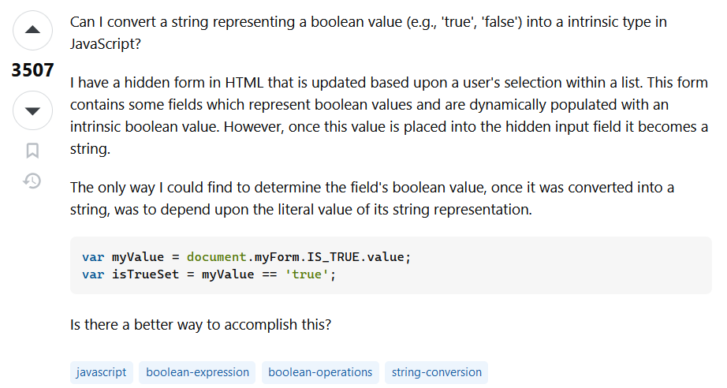
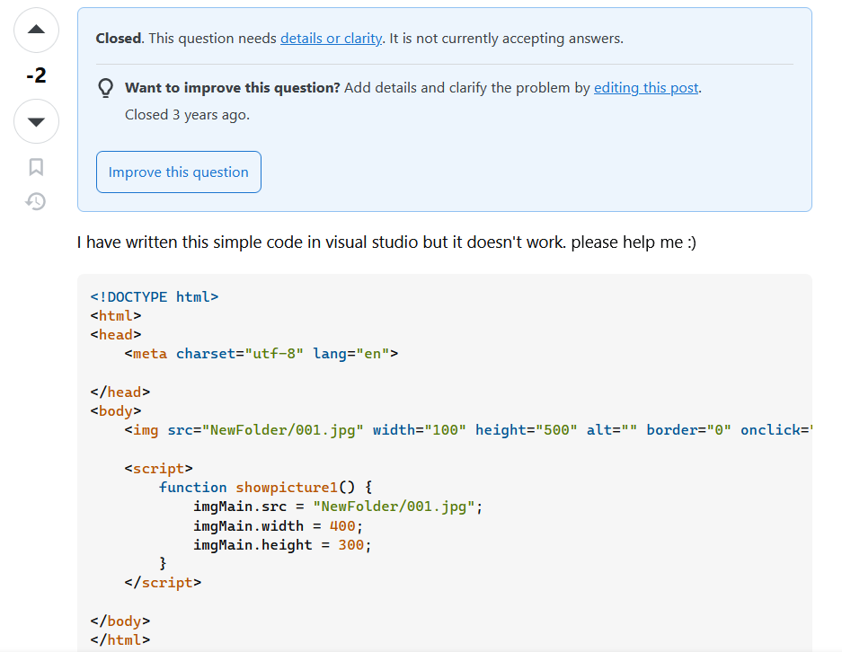

## Intro

Sometimes (and by that, I mean a lot of times) engineers run into problems. That’s just part of the job! But where do you turn to when you have been at a problem for an ungodly amount of time? I would say that if you have a supervisor near you at the workplace, sometimes it’s best to ask them because chances are that they have run into the same issue or are experienced enough to help you work through it. But what if they are busy? What if the project isn’t in the workplace, but your own personal project? Where do you go?

As a software developer, in my experience, most turn to the website and online forum Stack Overflow [add link here]. It’s the hub for getting all your programming answers! The key to getting the correct answer though is, you guessed it, asking smart questions.

## What is a smart question?

A smart question, according to a popular hacking article “How To Ask Questions The Smart Way,” is a question that clearly states the problem to be addressed and what was done to try to fix it. Other aspects make a question smart, but the idea is that the question isn’t easily solvable with a Google search and attempts have been made to remedy the issue. This is key in any engineering practice as time is precious and having to ask more questions to clarify the issue or leaving out important information in a project when addressing a problem can be costly and even cause more problems down the line!

## Example of a smart question:

Let’s look at [this Stack Overflow question](https://stackoverflow.com/questions/263965/how-can-i-convert-a-string-to-boolean-in-javascript) as an example of a smart question:

What makes this a smart question? Well for starters, the main question they are trying to address is at the top and is stated in one sentence! That is a great start since it is concise and states the focus of the question upfront. It also states the programming language which is good since it will attract that language’s experts to the problem.

Then they go into some details about their project. They state why they need to convert a string to a boolean value for their project. This weeds out some of the responses like “Just use a boolean” or something similar.

Finally, they give an example of what they tried, and how it worked. They ended their response with, “Is there a better way to accomplish this?” Not only is it perfect that they tried to get an answer to their problem upfront and provided what they tried, but also they asked a great question at the end! They already know how to do this, but they are looking for a more efficient solution.

The way this question was asked works. It helps narrow down the responses to get the one that is needed to fix the problem, and in response, it has a lot of upvotes and support in the comments!

## Example of a not-so-smart question

So we saw an example of a smart question. What does a not-smart question look like? Well here is [a question that was not-so-smart](https://stackoverflow.com/questions/60168669/how-can-i-make-this-code-betterbecause-it-doesnt-work-now):

What makes this question not smart, is that they just stated “It doesn’t work.” There is no context as to why it might not work. Are they simply inexperienced with html so it is highly probable that there is a syntax error? Based on the way they asked the question, it could probably be assumed, but who has time for that? They didn’t even specify the error message, so whoever answers the question has to fire up their own IDE and try to run it themselves.

The only good thing about this question is that the code provided is formatted the way it should be on the forum’s webpage and that the code was provided. Now, this person got an answer, but the question, in general, was not well received with 2 downvotes. There was only one response too and no indicator that it was a good one at that.

## Conclusion

Given these two examples from stack overflow, you can see that asking smart questions matters! Communication is a skill of engineering and programming that is often neglected in school, so do make an effort to build those skills and start asking smart questions to be a smart cookie!
