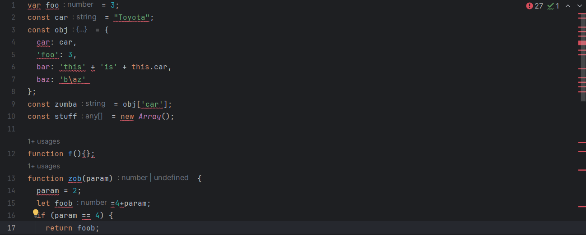

Never before have I been told that I had to follow certain standards while coding. It’s always been “just make sure your code is readable”. I always wondered how large companies can keep their code organized and if there was a specific format since code can be created in so many different ways. I didn’t even know coding standards existed until recently! But just like writing a paper in MLA format, it makes sense that there would be standards for coding. However, you might be wondering, why should we even bother dealing with coding standards?

## What are coding standards?

Coding standards are guidelines and rules to adhere to a certain format. This can pertain to naming variables in a standard way (ie camelcase) to having specific spacings and indents. Just like MLA format, the text is in a specific font and has certain spacing. There are lots of different coding standards depending on the language and formats of your programs. There can even be checkers in the IDE that make sure you are following the standards by throwing errors or warnings for parts of the program that don’t follow standards. 


Above is an image of the errors ESlint is throwing for the given code.

Look at how coding standards change an ok chunk of code into a clean and readable piece of code:

Code without ESlint:

```
var foo = 3;
const car = "Toyota";
const obj = {
  car: car,
  'foo': 3,
  bar: 'this' + 'is' + this.car,
  baz: 'b\az'
};
const zumba = obj['car'];
const stuff = new Array();

function f(){};
function zob(param) {
  param = 2;
  let foob=4+param;
  if (param == 4) {
    return foob;
  }
}
```


Code with ESlint fixes:
```
const car = 'Toyota';
const obj = {
  car,
  foo: 3,
  bar: `this is${this.car}`,
  baz: 'baz',
};
const zumba = obj.car;
const stuff = [];

function f() {}
function zob(param) {
  const foob = 4 + param;
  if (param === 4) {
	return foob;
  }
  return foob + 3;
}
```

If you compare the examples above, you can see that not only did the changes make the code more readable, but it made it shorter too! 

## Experiences with Coding Standards: a Personal Take

So I have been using IntelliJ as my IDE while programming in JavaScript, and I have been introduced to the ESlint checker. Right now I have it set up to throw an error when it is not formatted correctly. I haven’t had much experience using it, but so far I have found it both annoying and helpful. The reason I find it annoying is because if the IDE is throwing an error, then you aren’t sure if it is because the code isn’t functional or if it’s just not formatted correctly. So it takes a little longer to program because I want to make sure all the errors are accounted for before testing my code. 

But overall, ESlint is very helpful because it makes my code look so much better and more organized! Sometimes when I try to solve a problem in a hurry, my spacing gets awkward and I use different methods of doing the same things. ESlint helps me keep it consistent so that it is also easier to debug later on!
After everything is said and done, I completely recommend adhering to coding standards since they will make your code more readable, more concise, and overall, better!
