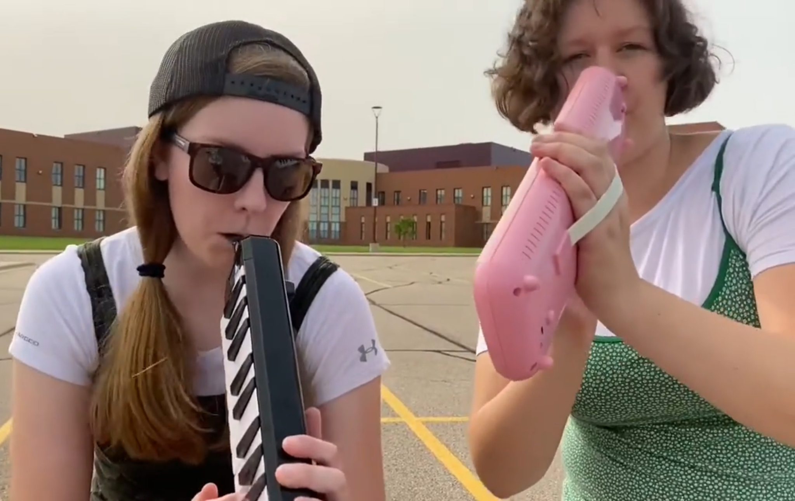
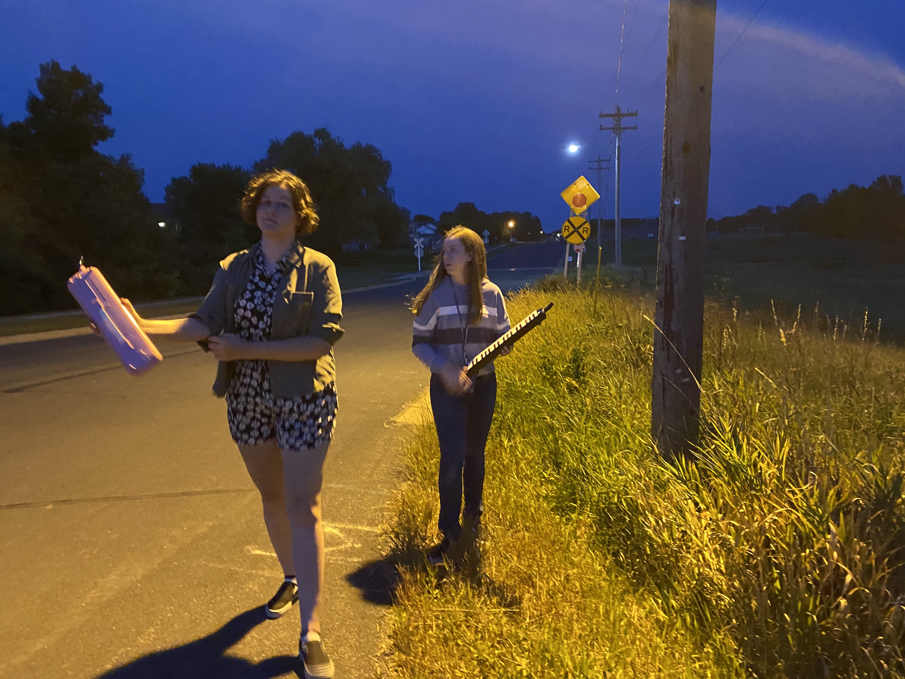

  
  
  

"Music Through the Decades" was a music video project produced for a local virtual variety show in 2020 during the COVID-19 pandemic. It featured myself and Ava Phillippi (a vocal performance major at the University of Minnesota Twin Cities) performing a variety of songs on melodicas from the past few decades. The medley was arranged as an original composition by Ava Phillippi. The drum section was written and performed by myself. The song itself was recorded by Phillippi and me, and I edited the song for the final video. Sydney Mancini acted as our videographer and the bodyguard in one of the scenes. The artistic shots and fashion were a collaboration between the three of us, and I took hold of the final video editing.

The overarching goal of the project was to have fun and give people entertainment during troubling times. It was not perfect, but given that the goal was to have fun and provide entertainment, the project was a success! [Here is the video.](https://youtu.be/Jxjj9W_rGa4?si=zCk9gfkML4M0-iTJ)

What I learned from this project was that having fun working on a project with passionate people is the way to get a project done. This was one of the most fun projects I have ever worked on, and I would love to do it again someday if the stars align.

