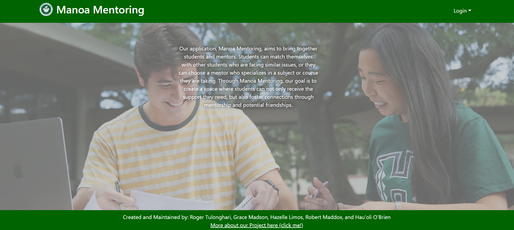

Manoa mentoring is a website that allows students to easily connect with other students to study by being a hub for people to create study sessions and join them for specific classes.
Some features of the site include a profile section to create a profile where students list their major and classes they are taking, the create a study session page, a calender, and many more features.

For this project, I was responsible for creating the calendar page and the user home page. I also took charge of deployment for the site and getting the custom domain for the site. Through this project, I learned more about meteor, databases, and using react libraries and reading documentation with them.
I also learned a lot of about project management and communicating with a team. This was a really valueable experience in my personal development!

