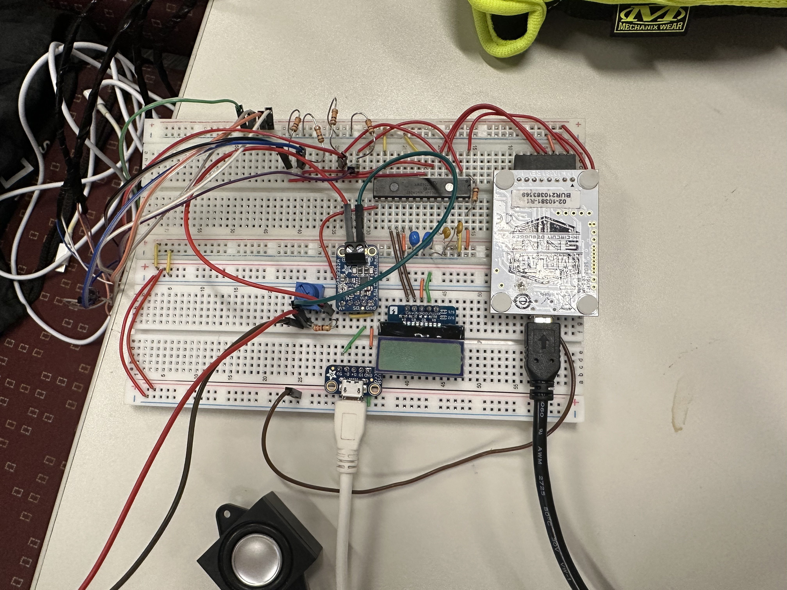
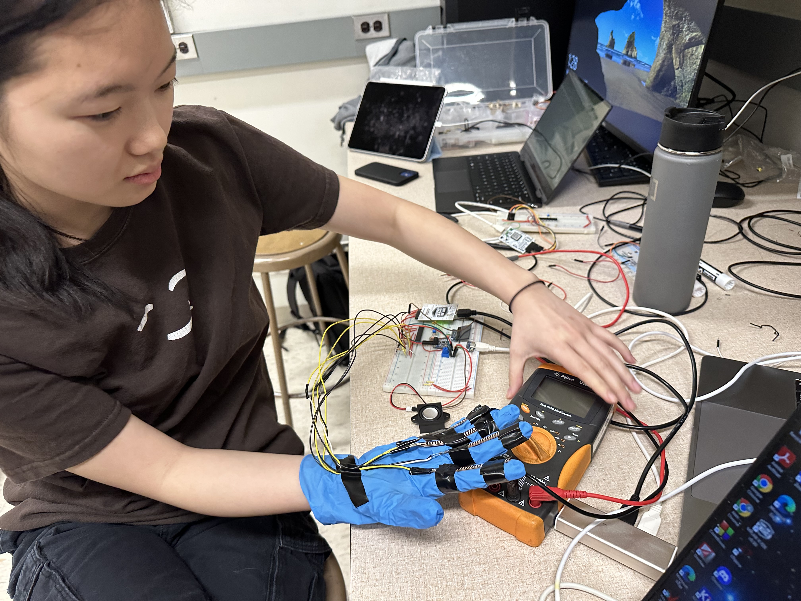
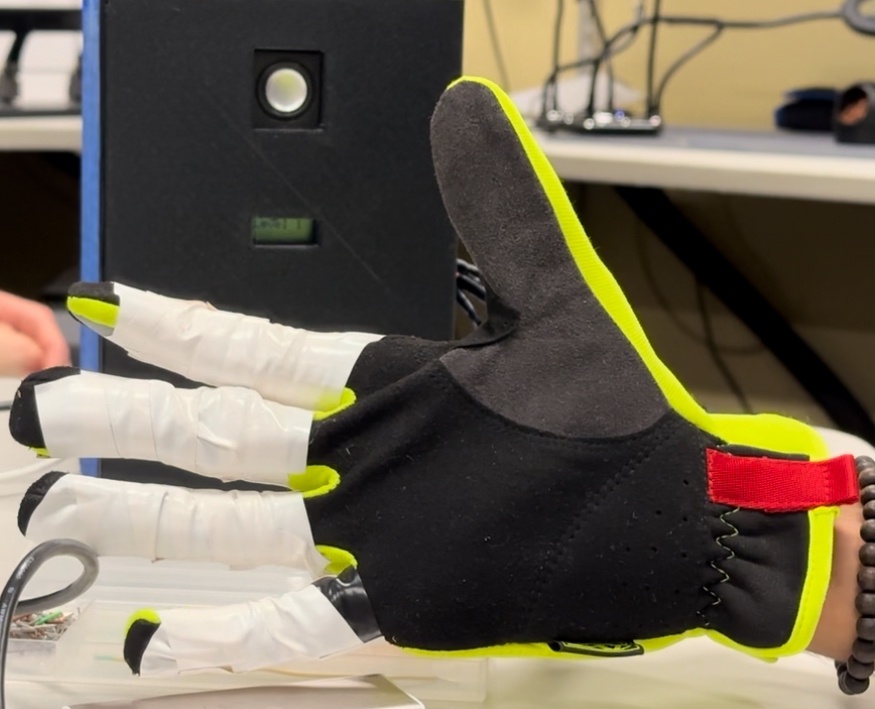

  
  
  

MusiGlove is an ear-training game played by bending your fingers! Each finger corresponds to a note and the
player's task is to listen to the speaker play a sequence of notes and replicate the pattern by bending
the correct fingers in the correct order.

The project itself consists of short flex sensors attached to a glove. Using ADC, the pic24 microcontroller is
able to sense if a finger is bent past a certain threshold (corresponding to a musical note). The levels would
play through a speaker attached to an amplifier. Other components included a 3D printed box, LCD screen, 
and breadboard with all necessary passive electrical components.

My contributions to this project were the general organization of the project structure (main program logic
organization), but mostly the speaker/song programming. After each level, a jingle would play 
through the speaker which I programmed. 

I learned how to use a lower level microcontroller to create a complex project. This was one of my biggest takeaways, but I also learned how to read datasheets for all the parts that are needed for the project, and how all parts of the project could work together at the same time without causing code blocking. Overall, this has been my favorite college project so far, and I loved that two hobbies of mine (electronics and music) could combine together to create this!

