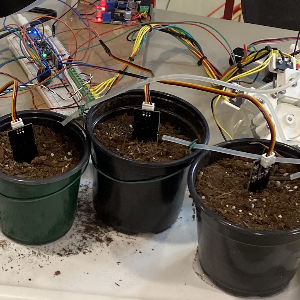

This project was created as a final project for the University of Minnesota course EE1301. The goal of the project was
to use the photon microcontroller and the Internet of Things (IoT) to create a project with the microcontroller. Our group
decided to create a plant monitoring system which included sensors to monitor temperature and moisture. All plant monitoring
information was available on "blink.io". From the site, one could also control a water pump, heating lamp, and 
cooling pad with a switch. 

My contribution to the project was programming the temperature sensor, the pressure sensor, and the humidity sensor in C++. I did this together with a partner within our group. This task was not very complex, but it was a vital part of monitoring the status of the plants

This was my first group project in college where I didn't know anyone else. I learned how to work in a group, and given that it was an introductory course, there was a variety of different skills and majors in the group. Despite not knowing each other, we came together as a team to create one of the best plant montoring systems the professor had seen.
